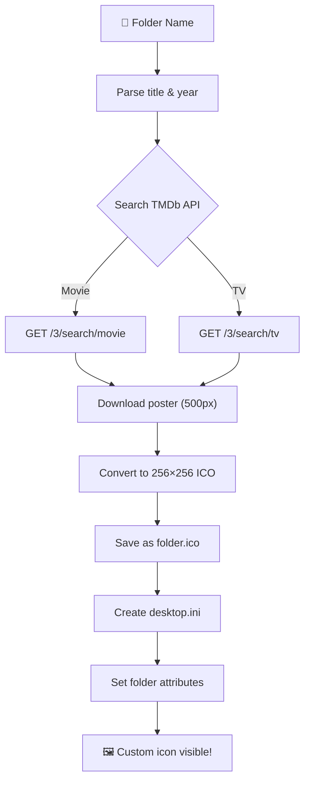

<div align="center">

# 🎬 Movie Manager Pro

### *Transform your chaotic media library into a beautifully organized collection*

[](https://docs.microsoft.com/en-us/powershell/)
[](https://www.microsoft.com/windows)
[](https://www.themoviedb.org/)
[](LICENSE)

[Features](#-features) •
[Installation](#-installation) •
[Quick Start](#-quick-start) •
[Usage](#-usage) •
[How It Works](#-how-it-works) •
[Configuration](#%EF%B8%8F-configuration) •
[FAQ](#-faq)

<br/>

---

</div>

## 🤔 The Problem

Your movie folder looks like this:

```
📁 Movies/
├── 📁 The.Dark.Knight.2008.1080p.BluRay.x265.HEVC.AAC.5.1-BONE
├── 📁 Inception.2010.2160p.4K.UHD.BluRay.REMUX.HDR.HEVC.Atmos-TiGER
├── 📁 Interstellar.2014.REMASTERED.1080p.BluRay.x264.DTS-HD.MA.5.1-FGT
├── 🎬 Parasite.2019.1080p.BluRay.mkv        ← loose file, no folder!
└── 📁 Caspers.First.Christmas.1979.1080p.WEB.UPSCALE.MULTI.AAC.2.0.H.265-OldT
```

**Ugly. Unreadable. A mess.**

## ✨ The Solution

After running Movie Manager Pro:

```
📁 Movies/
├── 🎬 The Dark Knight 2008/          ← with poster icon!
├── 🎬 Inception 2010/                ← with poster icon!
├── 🎬 Interstellar 2014/             ← with poster icon!
├── 🎬 Parasite 2019/                 ← auto-created folder + poster icon!
└── 🎬 Caspers First Christmas 1979/  ← with poster icon!
```

**Clean. Beautiful. Every folder has its movie poster as the icon.** 🍿

<br/>

---

## 🚀 Features

<table>
<tr>
<td width="50%">

### 📂 Smart Folder Renamer
- Strips technical junk (codec, quality, release group)
- Converts `Dots.And_Underscores` to proper spaces
- Extracts and preserves the year
- Moves loose video files into their own named folders
- Removes website watermarks (YTS, RARBG, MkvDrama, etc.)
- Handles TV series tags (S01E01, Season 1, etc.)

</td>
<td width="50%">

### 🖼️ Poster Icon Setter
- Fetches high-quality posters from TMDb
- Converts posters to 256×256 ICO format
- Sets custom folder icons via `desktop.ini`
- Supports both **Movies** and **TV Series** search
- Progress bar with real-time status
- Skips folders that already have icons

</td>
</tr>
<tr>
<td>

### ⚡ Full Auto Mode
- Run **both tools in sequence** with a single command
- Point it at a folder and walk away
- Perfect for bulk-organizing new downloads

</td>
<td>

### 💾 Persistent Config
- API token saved locally — enter it once, use forever
- Config stored as JSON next to the script
- Supports drag & drop folder paths

</td>
</tr>
</table>

<br/>

---

## 📦 Installation

### Prerequisites

| Requirement | Details |
|---|---|
| **OS** | Windows 10 / 11 |
| **PowerShell** | 5.1+ (pre-installed on Windows) |
| **TMDb Account** | Free API key from [themoviedb.org](https://www.themoviedb.org/settings/api) |

### Steps

**1.** Clone this repository (or download the script):

```bash
git clone https://github.com/yourusername/movie-manager-pro.git
cd movie-manager-pro
```

**2.** Get your free TMDb API key:

> 1. Create a free account at [themoviedb.org](https://www.themoviedb.org/signup)
> 2. Go to **Settings** → **API** → **Create** → Request an API key
> 3. Copy your **API Read Access Token** (the long one starting with `eyJ...`)

That's it. No other dependencies required. 🎉

<br/>

---

## ⚡ Quick Start

```powershell
# Run the script
powershell -ExecutionPolicy Bypass -File movie_manager.ps1
```

Or right-click `movie_manager.ps1` → **Run with PowerShell**

<br/>

---

## 📖 Usage

### Interactive Menu

When you launch the script, you'll see a beautiful interactive menu:

```
  .----------------------------------------------------------.
  |                                                          |
  |   [1]  Folder Renamer                                   |
  |        Clean up messy folder names to Title Year         |
  |        Move loose files into their own folders           |
  |        Works for Movies & TV Series                      |
  |                                                          |
  |   [2]  Poster Icon Setter                                |
  |        Fetch posters from TMDb (Movies & TV)             |
  |        Set them as custom folder icons                   |
  |                                                          |
  |   [3]  Full Auto (Rename + Set Icons)                    |
  |        Run both tools in sequence                        |
  |                                                          |
  |   [0]  Exit                                              |
  |                                                          |
  '----------------------------------------------------------'
```

### Option 1 — Folder Renamer

Cleans up messy folder names and organizes loose files.

```
Enter your choice: 1

Enter the folder path (or drag & drop a folder here):
> E:\Movies

What type of content is in this folder?
  [1] Movies
  [2] TV Series
> 1
```

**Before & After Examples:**

| Before | After |
|---|---|
| `The.Dark.Knight.2008.1080p.BluRay.x265-BONE` | `The Dark Knight 2008` |
| `Inception.2010.2160p.4K.UHD.BluRay.REMUX` | `Inception 2010` |
| `My Mister - MkvDrama.net` | `My Mister` |
| `Sherlock.S01-S04` | `Sherlock` |
| `Sisyphus.The.Myth.S01E01.720p.10bit.WEBDL` | `Sisyphus The Myth` |

> **Note:** Only folder names are changed — file names inside are never touched.

### Option 2 — Poster Icon Setter

Fetches movie/TV posters from TMDb and sets them as folder icons.

```
Enter your choice: 2

Enter the folder path (or drag & drop a folder here):
> E:\Movies

What type of content is in this folder?
  [1] Movies
  [2] TV Series
> 1

Saved API token found: eyJhbGciOiJIUzI1...
Use saved token? [Y/n]: Y

  [████████████████████████████░░] 90% (27/30)
    Interstellar 2014
      Searching: 'Interstellar' (2014)
      Found: Interstellar (2014-11-05)
      Icon set! ✓
```

### Option 3 — Full Auto

Runs the Folder Renamer first, then the Poster Icon Setter — one command does everything.

```
Enter your choice: 3

Enter the folder path (or drag & drop a folder here):
> E:\TV Series

What type of content is in this folder?
  [1] Movies
  [2] TV Series
> 2

// Renaming happens first...
// Then icons are fetched and applied...
// Done! 🎉
```

<br/>

---

## 🔧 How It Works

### Folder Renamer — Cleaning Logic


The script uses a **curated list of 60+ technical keywords** to identify where the title ends and the junk begins:

- **Quality:** `1080p`, `2160p`, `720p`, `4K`
- **Source:** `BluRay`, `WEBRip`, `WEB-DL`, `HDRip`, `DVDRip`
- **Codec:** `x264`, `x265`, `HEVC`, `AVC`, `H.265`
- **Audio:** `AAC`, `DTS`, `Atmos`, `FLAC`, `AC3`
- **Tags:** `REMASTERED`, `EXTENDED`, `UNRATED`, `HDR`
- **Groups:** `BONE`, `YTS`, `RARBG`, `Tigole`, `TiGER`
- **Sites:** `MkvDrama.net`, `YTS.MX`, `pahe.in`

### Poster Icon Setter — Pipeline



<br/>

---

## ⚙️ Configuration

### Config File

On first run, the script saves your TMDb token to `movie_manager_config.json` in the same directory:

```json
{
  "TMDbToken": "eyJhbGciOiJIUzI1NiJ9..."
}
```

> **Security Note:** This file contains your API token. Add it to `.gitignore` if you're pushing to a public repo.

### Supported Video Extensions

The following file types are recognized as media files when organizing loose files:

```
.mkv  .mp4  .avi  .mov  .wmv  .flv  .webm  .m4v  .ts  .mpg  .mpeg
```

Archive files (`.zip`, `.rar`, `.7z`) are also organized.

<br/>

---

## 🛡️ Safety

- ✅ **Only renames folders** — files inside are never modified
- ✅ **Non-destructive** — no data is deleted, just reorganized
- ✅ **Idempotent** — safe to re-run; skips already-clean folders and existing icons
- ✅ **No admin required** — runs with standard user permissions

<br/>

---

## ❓ FAQ

<details>
<summary><b>Icons aren't showing up in Explorer?</b></summary>
<br/>

Press **F5** to refresh, or restart Windows Explorer:
```powershell
Stop-Process -Name explorer -Force; Start-Process explorer
```
Windows caches folder icons aggressively. A restart of Explorer will force it to reload.

</details>

<details>
<summary><b>Can I undo the renaming?</b></summary>
<br/>

The script doesn't create a log of old names (yet). If you want to preview changes first, you can add a `-WhatIf` dry run mode. For now, make sure you're happy with a small test before running on your entire library.

</details>

<details>
<summary><b>A movie/show wasn't found on TMDb?</b></summary>
<br/>

This usually happens when:
- The folder name has a **typo** (e.g., `sillicon valley` → `Silicon Valley`)
- The title is **too obscure** or it's a bonus feature / documentary
- The folder was already named incorrectly before renaming

Fix the folder name manually and re-run — the script will pick up any folders without icons.

</details>

<details>
<summary><b>Does it handle non-English titles?</b></summary>
<br/>

Yes! TMDb has excellent international coverage. Titles in Korean (한국어), Turkish, Japanese, etc. are fully supported. The script preserves Unicode characters in folder names.

</details>

<details>
<summary><b>Can I use this on a NAS or external drive?</b></summary>
<br/>

Yes, as long as the drive is mounted as a Windows drive letter (e.g., `E:\`). Just provide the path when prompted. Note that folder icons using `desktop.ini` are a Windows feature and may not be visible from other OS clients accessing the NAS.

</details>

<br/>

---

## 🗺️ Roadmap

- [ ] Dry-run / preview mode
- [ ] Undo / rollback with rename log
- [ ] Anime support (AniList/MyAnimeList integration)
- [ ] Batch processing multiple directories
- [ ] GUI version (WPF/WinForms)

<br/>

---

## 🙏 Credits

- **[TMDb](https://www.themoviedb.org/)** — Movie & TV metadata and poster images
- Built with ❤️ in PowerShell

<br/>

> *This product uses the TMDb API but is not endorsed or certified by TMDb.*
>
> 

<br/>

---

<div align="center">

**If this saved you hours of manual organizing, give it a ⭐!**

Made with 🍿 by a fellow movie hoarder

</div>
